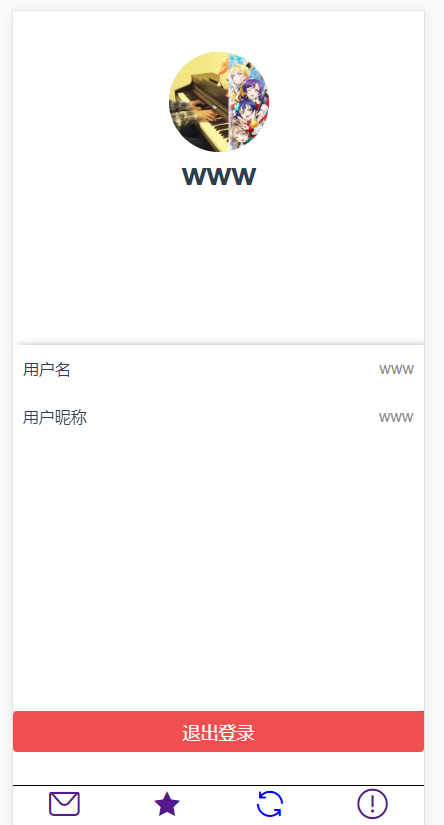
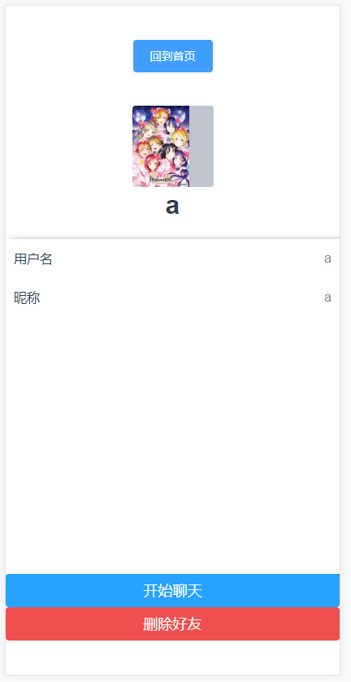
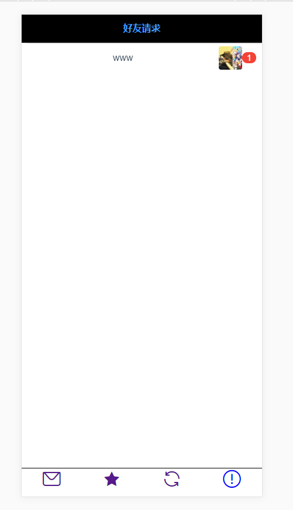
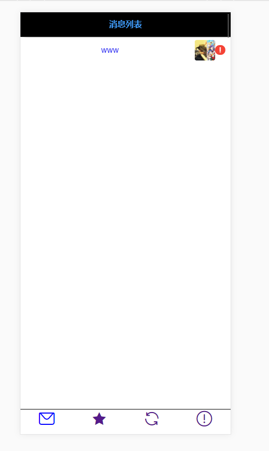

# vuesocket

## Project setup
```
npm install
```

### Compiles and hot-reloads for development
```
npm run serve
```

### Compiles and minifies for production
```
npm run build
```

### Run your tests
```
npm run test
```

### Lints and fixes files
```
npm run lint
```

### Customize configuration
See [Configuration Reference](https://cli.vuejs.org/config/).


# 项目的主要实现

## 实现基本的websocket

### 前端

下载vue-socket.io 

```
    npm install vue-socket.io --save
```

main.js中引入

```
import VueSocketio from "../node_modules/vue-socket.io"
```

指定连接的端口

```
Vue.use(new VueSocketio({
  debug:true,
  connection:"http://localhost:3001/"
}))
```

在组建中使用vue-socket.io

在组件中定义sockets，把要用到的方法放到里面

```
 sockets:{
    reconnect(){
     console.log("重新连接");
    },
   disconnect(){
     console.log("断开连接");
   },
   receive(data){
     console.log("收到的消息是"+data);
   },
}
```

向后端发送事件

```
this.$socket.emit("PostTalkSocket",Msg);
```

**注意：在父子组件中如果定义相同名字的事件，触发会同时触发！**

**注意：在父子组件中如果定义相同名字的事件，触发会同时触发！**

**注意：在父子组件中如果定义相同名字的事件，触发会同时触发！**

**可以在根组件中注册一些经常用的主要事件**(接收消息，接受好友请求，进行提醒)

### 后端

安装socket.io

注意配置的写法，网上好多都是错的

```
const Koa = require('koa')
const app = new Koa()
const server=require("http").createServer(app.callback());
const io=require("socket.io")(server);
```

具体实现：

```
io.on("connection",(socket)=>{
  socket.on("reconnect",data=>{
    console.log("重新连接"+socket.id);
  })；
  console.log("开始连接");
  // console.log("这个socketid是"+socket.id);
  // console.log("这个链接的room"+socket.rooms);it("receive",data);
  });
  socket.on("regist",(data)=>{
    console.log("新用户的id是"+data);
    socket.id=data;
    client[data]=socket;
  })；
  socket.on("disconnect",(data)=>{
    client.delete(socket.id);
    console.log("断开连接");
  });
})
```

向前端触发事件

```
io.emit("receive",data);
```

## 登录的相关工作

- 判断用户的用户名和密码正确以后将这个socket的socket的id改为用户名，用来识别用户
- 创建了一个client的map用来存储当前有哪些在线的用户

##  聊天功能

### 进入聊天室

- 用户进入和别人的聊天页面以后，将所有未读消息置为已读消息(ClearMessage)
- 获取以前的聊天信息，初始化对话框(GetTalkMessage)

### 发送聊天消息

- emit一个PostTalkSocket事件，发送相关消息
- 将当前聊天室信息加入首页/MainPage/Message，加入后进行数组去重（去重this.$store.state.MessageList）
- 后端接收到发送者发的数据包,在client中寻找要接受消息的用户是否在线，如在线则直接发送消息，不在线则不管，同时将这条消息的相关数据存进数据库，消息的已读标记为0,。
- 用户在在线的情况下通过GetTalkSocket事件得到自己有未读消息，在/MainPage/Message中添加新的聊天通知信息（this.$store.state.MessageList。用户在不在线的时候收到了消息，会在一开始初始化Message组建的时候进行渲染相关聊天室，提醒自己有未读消息
- 在线用户在收到消息的时候要进行当前路径判断，如果用户正在聊天室界面，则直接将发过来的消息已读标记置为1，不在聊天室界面则记得在Message组件中进行渲染

### 发送好友请求

- 前端AddFriend，发送请求，后端接收两人的名字，将好友标记flag置为0
- 前端出发AddFriendSocket事件，后端判断被加好友的人在线否，如在线则触发ReceiveFriednSocket，前端在好友请求组件中渲染出新来的好友请求。如果用户不在线则不作任何操作
- 用户登录时进入好友请求组件的时候记得初始化渲染。


# 简单功能的实现

- 主页面搜索人，添加好友（在线/离线状态下）
- 一对一聊天

# 大概效果










